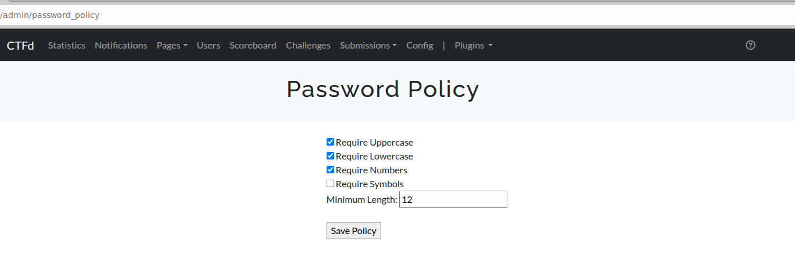
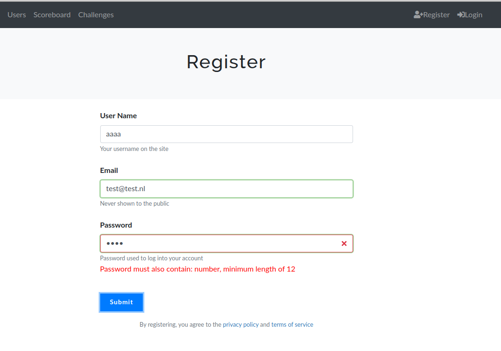

# CTFd-plugin_password-policy
Allows you to set a password policy to CTFd. The policy will be checked when registering, and when changing a password. 
The policy is checked on JavaScript level as well as in the back-end.

## Installation
Copy the password_policy folder into the `CTFd/CTFd/plugins/` directory and restart CTFd.

## Example:

